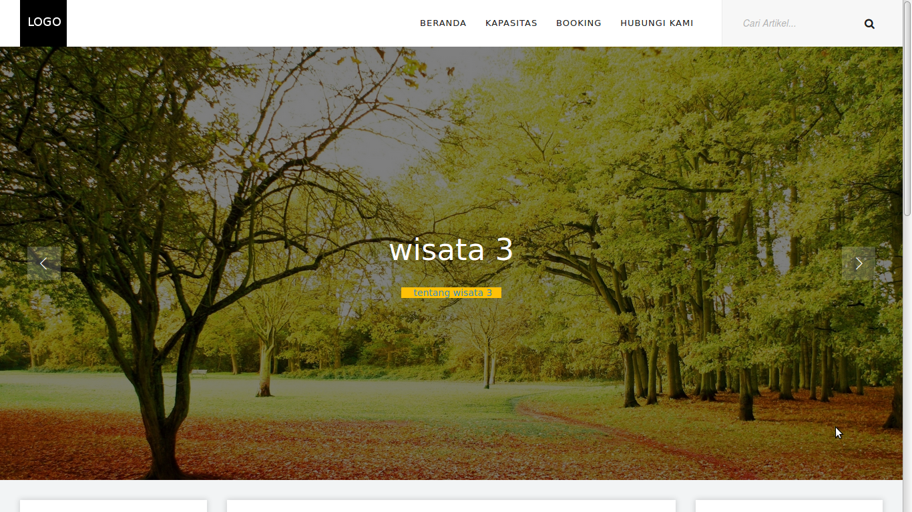
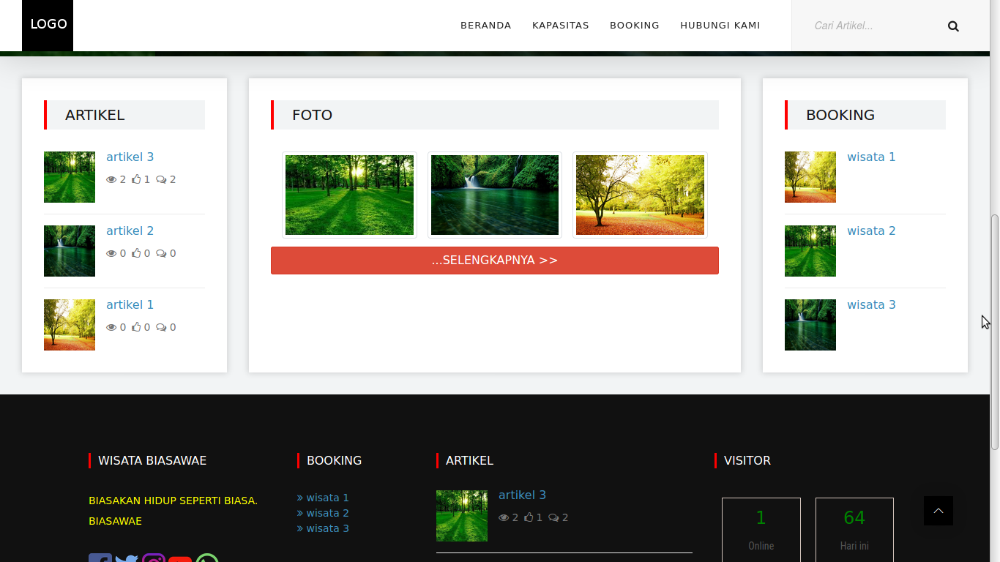
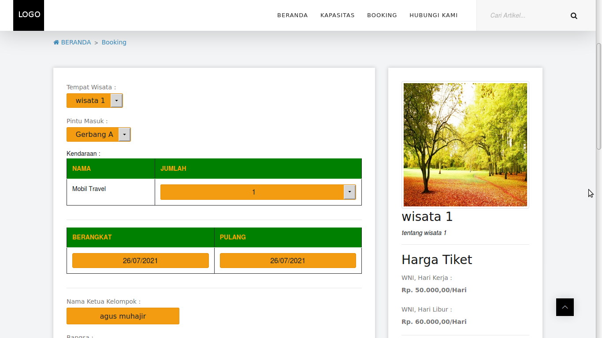
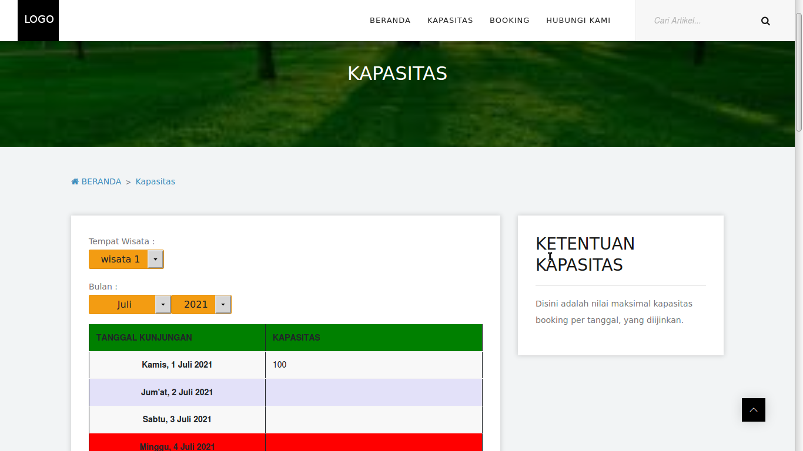
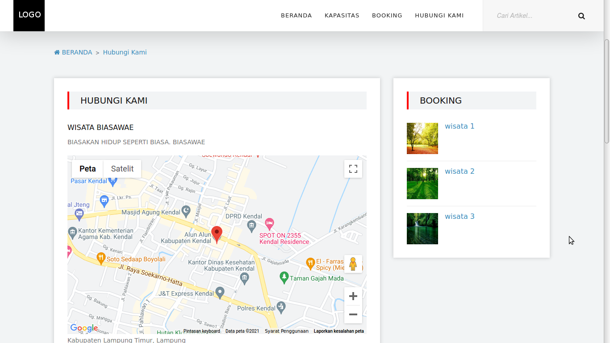
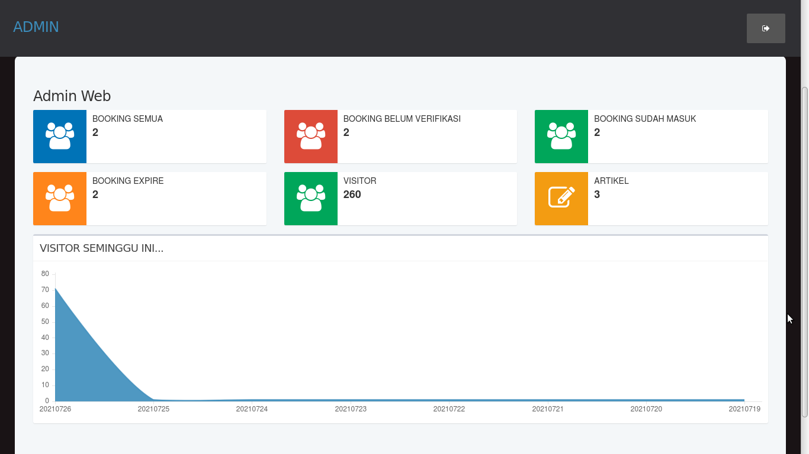
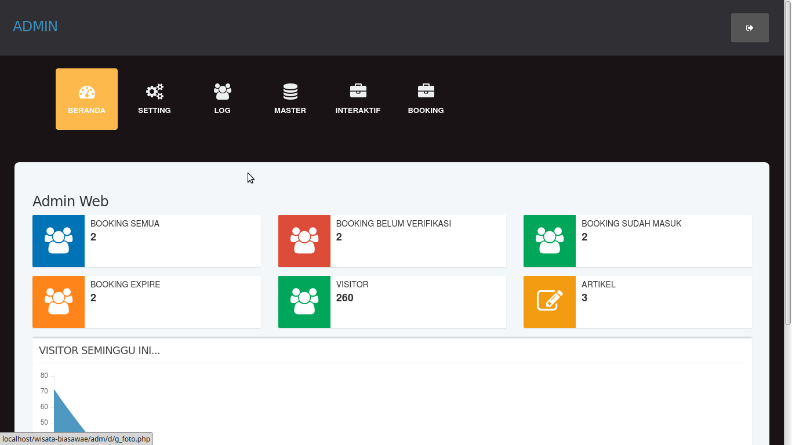

# wisata-biasawae

WISATA-BIASAWAE v1.0, Web informasi wisata dan booking           

Cocok untuk kelola booking online objek wisata.                  

baik tempat wisata yang dikelola dinas pariwisata maupun bumdes  

Dibuat dan dites dengan WebServer XAMPP PHP 7.4 . Pada LinuxMint.

---

Dikembangkan oleh : Agus Muhajir                                 
E-Mail : hajirodeon@gmail.com                                    
HP/SMS/WA : 081-829-88-54                                        
source code : http://github.com/hajirodeon                       

---

FITUR :
- Berita/Informasi Objek Wisata.

- Komentar untuk Berita/Informasi Objek Wisata.

- Set Profil Tempat Wisata.

- Set Foto dan SlideShow Image.

- Buku Tamu.

- Kapasitas per Tanggal.

- Booking Objek Wisata.

- Set Tiket Masuk yang berbeda untuk tiap tanggal, dan WNI/WNA.

- Set Sewa Kendaraan.

- History Booking.

- Print PDF Booking. 

---

INSTALASI DAN KONFIGURASI :  

1. Ekstrak file web ke folder web webserver www atau htdocs

2. Untuk konfigurasi, bisa set di file /inc/config.php

3. Jalankan phpmyadmin, buatlah sebuah database. dan lakukan import file database .sql, ada di folder /db

4. Jalankan WISATA-BIASAWAE sesuai alamat web yang ada.

---

Buka http://alamat-web-yang-telah-dibuat/admin

CONTOH AKSES USER ADMIN :

User : admin  

Pass : admin

---

TAMPILAN / SKRINSUT :  

 

 

 

 

 

 

 

---

NB. 

DEMO ONLINE atau ingin request custom konten berbayar, silahkan bisa hubungi : 

hp/sms/wa : 081-829-88-54 

atau email : hajirodeon@gmail.com

